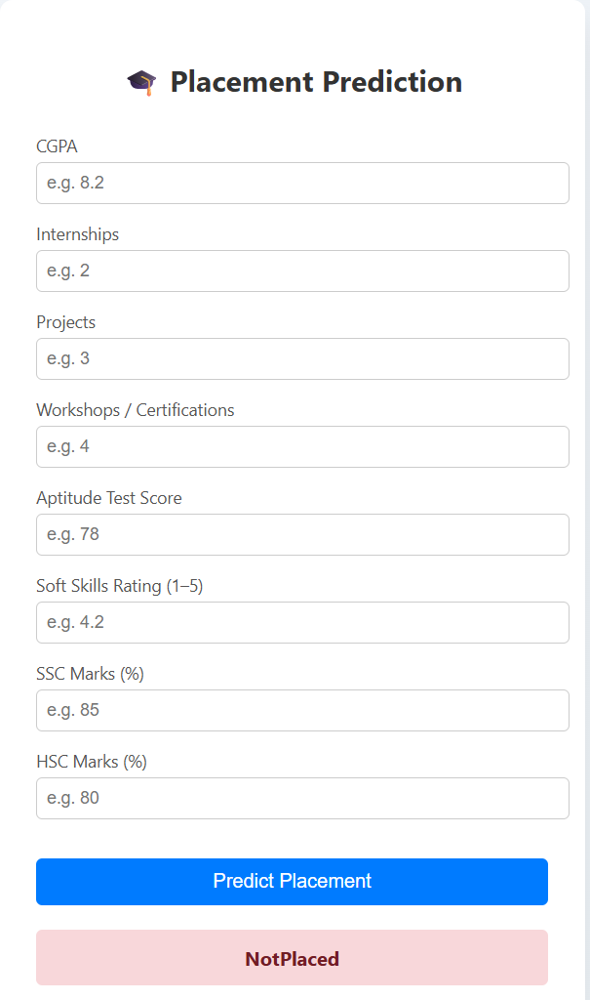
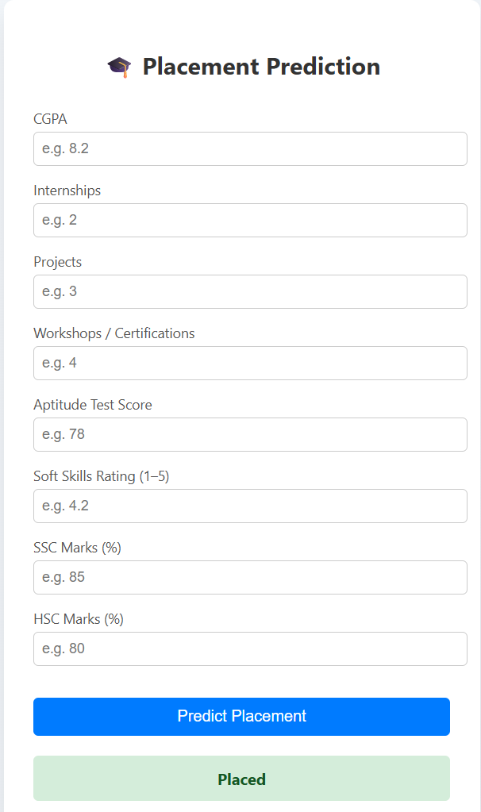

# 🎓 Placement Prediction System (End-to-End ML Project)

An **end-to-end Machine Learning system** that predicts whether a student will be **Placed or Not Placed** based on academic performance, skills, and training data.

This project is built using **industry-standard ML practices**, including EDA, feature engineering, cross-validation, model comparison, evaluation, and deployment using **Flask (API + Web UI)**.

---

## 📌 Problem Statement

Campus placement outcomes depend on multiple factors such as CGPA, internships, projects, aptitude scores, and soft skills.  
The goal of this project is to **predict placement status** and help institutions or students understand placement readiness.

- **Type:** Supervised Learning  
- **Task:** Binary Classification  
- **Target Variable:** `PlacementStatus`

---

## 🧠 ML Lifecycle Followed (Industry Workflow)

1. Business Problem Understanding  
2. Data Ingestion & Validation  
3. Exploratory Data Analysis (EDA)  
4. Feature Engineering & Preprocessing  
5. Model Training (Multiple Models)  
6. Cross-Validation & Model Selection  
7. Model Evaluation & Error Analysis  
8. Model Packaging (Artifacts)  
9. Deployment using Flask (API + UI)

---

## 📊 Dataset Information

- **Rows:** 10,000  
- **Features:** Academic scores, internships, projects, certifications, aptitude score, soft skills, training  
- **Target:** PlacementStatus (Placed / Not Placed)

Raw data is stored separately to avoid data leakage and ensure reproducibility.

---

## 🔍 Exploratory Data Analysis (EDA)

Key insights from EDA:
- Target variable is reasonably balanced
- `StudentID` removed to prevent data leakage
- Numerical features require scaling
- Binary features like `PlacementTraining` show strong correlation with placement
- No severe multicollinearity detected

EDA is performed in a dedicated Jupyter notebook (notebooks are not used for production code).

---

## 🛠 Feature Engineering & Preprocessing

- Train-test split with **stratification**
- Numerical features scaled using **StandardScaler**
- Categorical features encoded manually
- Target encoded separately to avoid leakage
- All transformers saved as artifacts for inference consistency

---

## 🤖 Models Trained & Compared

The following models were trained and evaluated using **Stratified K-Fold Cross-Validation**:

| Model | Reason |
|---|---|
| Logistic Regression | Interpretable baseline |
| Random Forest | Handles non-linear relationships |
| Gradient Boosting | Strong performance & stability |

### 📌 Model Selection Criteria
- Cross-validated performance
- Stability (low variance)
- Balanced precision & recall (F1-score)

---

## 📈 Model Evaluation

Evaluation performed on a **held-out test set**:

- Accuracy
- Precision
- Recall
- **F1-score (primary metric)**
- Confusion Matrix analysis

Balanced error handling was prioritized to avoid both:
- False Positives (overconfidence)
- False Negatives (missed opportunities)

---

## 🚀 Deployment (API + Web UI)

The final model is deployed using **Flask** with:

### 🔹 REST API
- Endpoint: `/predict`
- Input: JSON
- Output: Prediction (Placed / Not Placed)

### 🔹 Web Interface
- Clean, interactive UI
- Form-based input
- Color-coded prediction result
- Separated HTML, CSS, and JavaScript

---

## 🖥️ Screenshots




## 🗂 Project Structure

Placement_Prediction/
│
├── data/
│ ├── raw/
│ └── processed/
│
├── notebooks/
│ └── 01_eda.ipynb
│
├── src/
│ ├── config.py
│ ├── data_loader.py
│ ├── preprocessing.py
│ ├── train.py
│ └── evaluate.py
│
├── artifacts/
│ ├── models/
│ ├── metrics/
│
├── app/
│ ├── app.py
│ ├── schemas.py
│ ├── templates/
│ └── static/
│
├── main.py
├── requirements.txt
└── README.md

## ⚙️ How to Run Locally

```bash
git clone https://github.com/Hunter926261/Placement-Prediction.git
cd placement-prediction

python -m venv PlacPred
PlacPred\Scripts\activate

pip install -r requirements.txt
python main.py
python app/app.py


Open browser similar to
http://127.0.0.1:5000/
visible on terminal